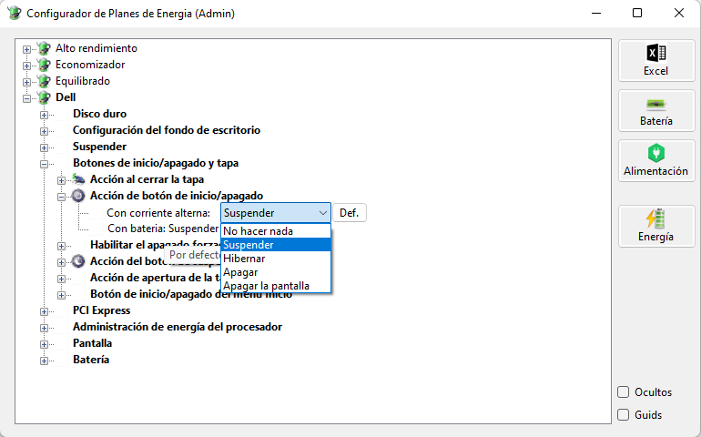

# PowerCFG
* A Graphical IDE for PowerCFG.
 * You can see/change all hidden values.
 * Restore to default values individually.
 * Runs in net6 C#
 * The IDE is similar a windows energy plan viewer.
 * You can export all configurations in Excel Copy/Paste format.
 

