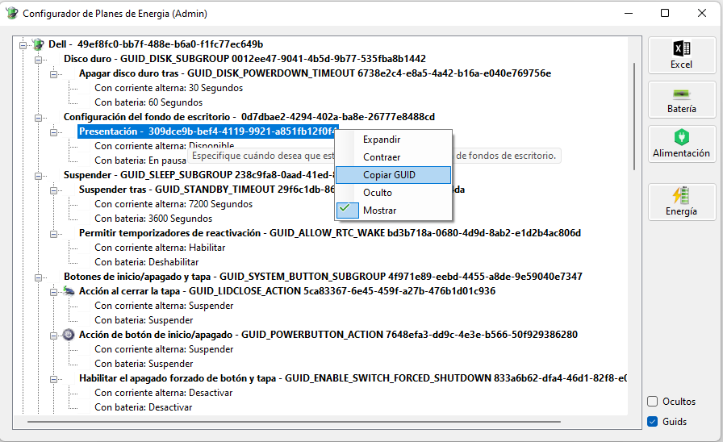

# PowerCFG
* A Graphical IDE for PowerCFG.
 * You can see/change all hidden values. Guid's optionally to paste in command line windows command PowerCFG.exe
 * Restore to default values individually.

 * Save (As Administrator), Restore, Duplicate & Delete Schemes
 
 * Import saved Schemes from .POW files.
 
 * Runs in net6 C#
 * The IDE is similar a windows energy plan viewer.
 * You can see & copy associated GUIDS and internal aliases 

 * You can export all configurations pasting in Excel the exported values.

 
